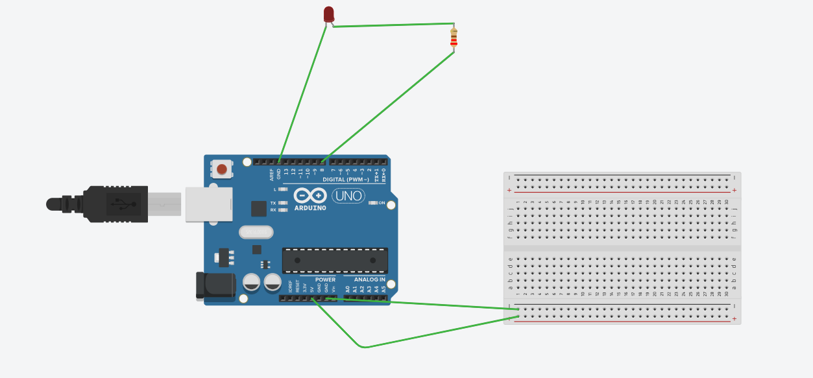

# Smart Home Automation (Tinkercad Simulation)

A simulated smart home automation system using Arduino Uno, DHT11 sensor, and LED, built 100% online using Tinkercad. It mimics IoT functionality using the Serial Monitor to control appliances.

## 🔧 Components
- Arduino UNO
- DHT11 Sensor
- LED + 220Ω Resistor
- Serial Monitor (to simulate Bluetooth input)

## 🎮 Features
- Turn light ON/OFF using serial input
- Read and display temperature and humidity
- Fully simulated online – no physical hardware needed!

## 🧪 Demo Commands
- `1` → Turn Light ON
- `2` → Turn Light OFF

## 🖼️ Screenshots

## 👩‍💻 Author
Meghana Mamillapalli 
Email: mamillapallimeghana2@gmail.com  
LinkedIn: [Meghana Mamillapalli](https://www.linkedin.com/in/meghana-mamillapalli)

---

*This project was created virtually to demonstrate my understanding of IoT, Arduino, and home automation systems.*
